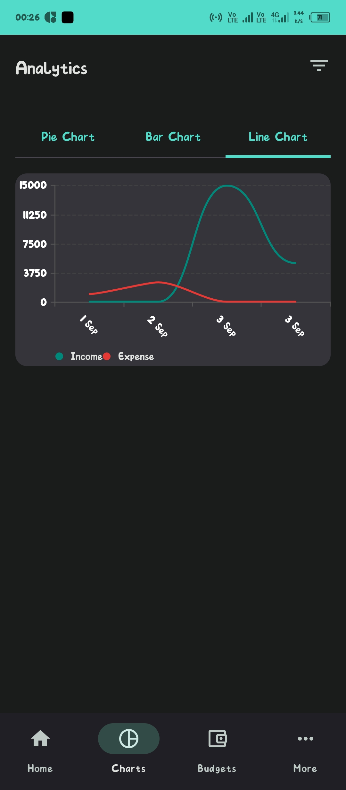

# SpendWise - An AI-Powered Android Finance Tracker 🦉

📥 **[Download APK](https://drive.google.com/file/d/1bxXNhZtAvu7wJZ4FJNR0yXzQxnj4TLgV/view?usp=sharing)**

SpendWise is a feature-rich, offline-first expense tracking application for Android, built with a modern, industry-standard technology stack. It provides users with powerful tools to manage their finances, from simple transaction logging to AI-powered insights and professional-grade analytics.

The entire application, from the initial concept to the final UI/UX polish, was built collaboratively with a large language model, showcasing a modern AI-assisted development workflow.

---

## ✨ Prime Features

### 🤖 AI-Powered Financial Insights

SpendWise goes beyond simple charts by integrating the Google Gemini API to act as a personal financial assistant. It analyzes your account balances and recent spending habits to provide concise, actionable advice, helping you understand your financial health and make smarter decisions.

### 🧾 OCR Receipt Scanning

Manual data entry is a thing of the past. Using Google's on-device ML Kit, you can instantly scan paper receipts with your camera. The app's custom parsing logic intelligently extracts the total amount and date, pre-filling the transaction form to make logging expenses effortless.

---

## 🚀 Key Features

This app was built in a phased approach, resulting in a comprehensive feature set:

### Offline-First & Cloud Synced

* Full offline support using a local Room database.
* Real-time, two-way data synchronization to Firestore.

### Secure User Authentication

* Polished sign-in/sign-up with Email/Password and Google Sign-In.
* Profile picture uploads and name/phone number management.
* Email verification and password reset support.

### Advanced Financial Model

* **Accounts System:** Create and manage assets (Bank, Cash) and liabilities (Credit Card, Loan Taken).
* **Transfers:** Accurately model movement of money between accounts (e.g., paying a credit card bill) without skewing income/expense totals.
* **Smart Loan & Credit Logic:** Handles debts correctly, including credit limits, preventing overpayment, and auto-settlement of paid-off accounts.

### Smart Financial Tools

* **Budgeting System:** Set and track monthly budgets per category with visual progress and month navigation.
* **Recurring Transactions:** Automate regular income/expenses with a daily background worker.
* **Search & Filtering:** Powerful search and advanced filters for date ranges and categories.

### Polished UI/UX & Analytics

* Custom, professional theme with full dark mode support.
* Dynamic, dashboard-style home screen with a branded top bar.
* Smooth screen transitions and micro-interactions.
* Dedicated analytics screen with dynamic Pie, Bar, and Line charts (built with Vico).
* Customizable categories and currency settings.
* Automated data export to Google Sheets via Firebase Functions for BI tools like Tableau.


---

## 📸 Screenshots

<div align="center">

### Home Dashboard

 

### Accounts & Transactions

  

### Charts & Analytics

  

### Budgets & Recurring

 

### Profile & Settings

 

</div>


---

## 🛠️ Tech Stack & Architecture

### Platform

* 100% Kotlin, Android Native

### UI

* Jetpack Compose

### Architecture

* MVVM (Model-View-ViewModel)

### Dependency Injection

* Hilt

### Local Database

* Room

### Background Processing

* WorkManager

### Backend & Cloud

* **Firebase Authentication:** User management (including Google Sign-In)
* **Firestore:** Real-time cloud database
* **Firebase Storage:** Profile picture uploads
* **Firebase Functions (Node.js):** AI insights, data deletion, Google Sheets integration

### AI & ML

* **Google Gemini API:** Financial insights generation
* **Google ML Kit:** On-device OCR text recognition

### Libraries & Utilities

* **Charting:** Vico
* **Image Loading:** Coil
* **Settings Persistence:** Jetpack DataStore

---

## 🚀 Setup & Installation

To run this project, you will need Android Studio, Node.js, and the Firebase CLI.

### 1. Firebase Project Setup

1. Create a new project in the Firebase Console.
2. Enable Authentication (Email/Password and Google providers), Firestore, Storage, and Functions.
3. Upgrade your project to the Blaze (pay-as-you-go) plan to use Functions.
4. Download the `google-services.json` file and place it in the `SpendWise/app/` directory of the Android project.

⚠️ **IMPORTANT SECURITY NOTICE**
Before you commit your code, you **MUST** add the `google-services.json` file to your project's root `.gitignore`. This prevents secret API keys from being uploaded to a public repository.

Add this line to your `.gitignore` file:

```bash
google-services.json
```

### 2. Backend (Firebase Functions)

1. Navigate to the `spendwise-functions/functions` directory.
2. Run `npm install` to install all dependencies.
3. Create a file named `.env` in this directory.
4. Get your Google Gemini API Key from Google AI Studio.
5. Create a Google Sheet for data export and get its ID from the URL.
6. Add your secrets to the `.env` file:

```env
SPENDWISE_SHEET_ID="YOUR_GOOGLE_SHEET_ID"
GEMINI_API_KEY="YOUR_GEMINI_API_KEY"
```

7. Follow the project guide to set up a Service Account and share your Google Sheet with it.
8. Deploy the functions by running:

```bash
firebase deploy --only functions
```

from the root `spendwise-functions` directory.

### 3. Frontend (Android App)

1. Open the SpendWise Android project in Android Studio.
2. Let Gradle sync all dependencies.
3. Run the app on an emulator or a physical device.

---

## 📌 About This Project

This project was developed as a comprehensive demonstration of modern Android development — from core functionality to advanced cloud, AI, and UI/UX design.
